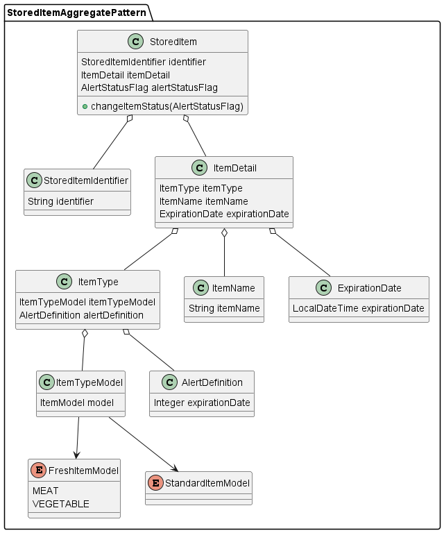

# LimitChecker
## Overview
The application manages expiration dates and automatically sends caution or warning e-mails as needed.  
This application is being developed for self-learning and my own life, and is not for commercial use or related to my work.

## Service
The validation process is performed as a periodic process using the Schedule annotation.  
Basically, validation is performed at exactly 8:00 AM to determine which foods to alert or warn.   

### Scheduled validation
If the expiration date is within the number of days specified in the AlertDefinition associated with the ItemType, the food is notified by e-mail as a caution item. For example, if a food item has an AlertDefinition of 3 days and an expiration date of October 10, a warning e-mail will be sent at 8:00 a.m. on October 7.
The alert email notifies the expiration date has passed. Specifically, the Service class will send an email notification if there is a consumption date that matches today's date as a warning item. This process is also executed at 8:00 AM.

## User Interface
**TBD** design, implements. I need to study about the front-end technology...

## Controller
The interface of the visible process and the back-end process handles the REST API with full specified messages.  
The controller receives the message and handle the information about item bellow;  
- Create a new stored item into the database
- Delete a stored item when it is consumed
- Modified an item name and expiration date

## Development
This application is built with the environment bellow;
- OpenJDK 17.0.7
- Spring boot 3.1.1
- IntelliJ IDEA 2023.1.2
- embedded H2DB

### Architecture
The architecture of this program is based on Domain driven development model.
There is only one aggregate model to manage the expiration date.  
### Aggregate pattern
StoredItem is designed by the given diagrams bellow;
  
